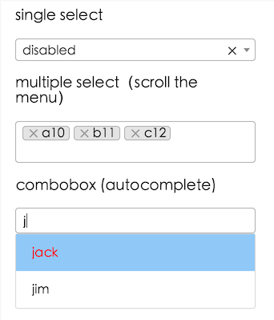

# {{ name }}

> {{ description }}

[](https://travis-ci.org/{{ gitUsername }}/{{ gitRepository }})
[](https://npmjs.org/package/{{ name }})
[](https://npmjs.org/package/{{ name }})


## Install

```shell
npm install {{ name }} --save
```

## Example

[]({{ homepage }}/example)

## Online documentation

[Online]({{ homepage }})

## Change log

[CHANGELOG](./CHANGELOG.md)

<!-- MR-H
<style>.gc-comments {font:12px/1.5 Lantinghei SC,Microsoft Yahei,Hiragino Sans GB,Microsoft Sans Serif,WenQuanYi Micro Hei,sans-serif}</style>
<div class="gc-comments" data-repos="<%- PACKAGE.gitUsername %>/<%- PACKAGE.gitRepository %>" data-issues="1" >
    <div class="gc-comments-title">
        Comments
    </div>
    <div class="gc-comments-info">
        Want to leave a comment here, please visit <a target="_blank" href="https://github.com/<%- PACKAGE.gitUsername %>/<%- PACKAGE.gitRepository %>/issues/1">Github issues</a>
    </div>
</div>
<script src="https://unpkg.com/github-comments@0.4.0/gc.js"></script>
 -->
